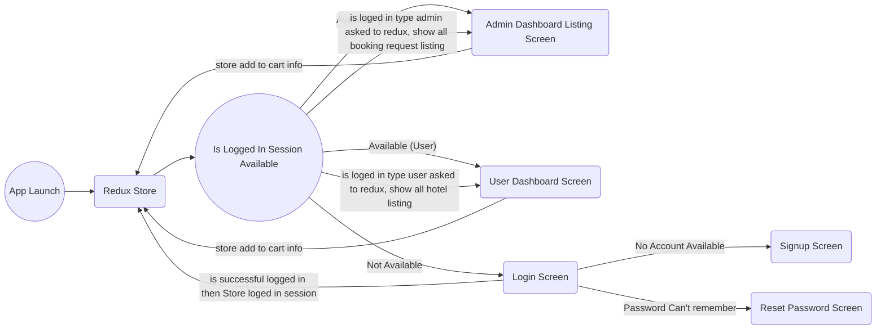

# Hotel Booking App

Hi All, 
Have created the Todo list app which contains the following pages & features:

 1. Login Screen
 2. Registration Screen
 3. Forget Password
 4. Dashboard - Hotel Listing
    - User all hotel listing
    - Admin hotel booking request screen
 6. Hotel Details Screen
    - User's screen contain book and cancel button
    - Admin screen contain accept and reject booking button
 8. Custom Header shows following details:
    - Back button
    - Title
    - Cart icon for user if there is any booking info available
    - Logout

***Learned Here:*** 

 1. Screen Design / JSX.
 2. Flex-Box
 3. Stylesheet
 4. Auth Flow using REDUX
 5. State -- Props
 6. Async storage (insert, delete)
 7. Session handling (Once login, don't need to login again)
 8. Different reducer handling

> Login Screen

> Reset Password Screen

> Signup Screen

> Email validation on Login Screen

> User's dashboard with list of hotel screens

> User's hotel details screen

> User's hotel details screen after booking
> - Booking button changed to cancel button
> - On header cart icon appeared along with item count

> User's hotel hotel listing page after cart item added

> Admin's dashboard contain list of booking request

> Admin's hotel details screen along with following button:
> - Accept Booking
> - Reject Booking

> Details screen showing booking status, whether it is accepted or rejected

